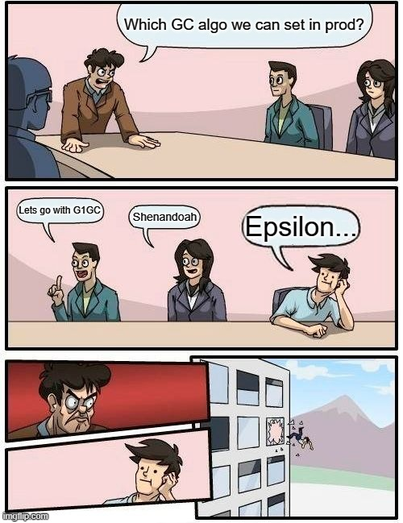

# 😆 Software Testing Jokes/Memes

> 😎 Collection of software testing related jokes/memes.  
> ✍ Send me a PR if you know a good joke or meme. Please add the credit if available.  
> 🙏 Please credit the authors, if you are using the above memes or jokes.

## 🎨 Memes ⚡

  

> Credit NaveenKumar Namachivayam

***

  

> Credit NaveenKumar Namachivayam

***

  

> Credit NaveenKumar Namachivayam

***

  

> Credit NaveenKumar Namachivayam

***

  

> Credit NaveenKumar Namachivayam

***

  

> Credit NaveenKumar Namachivayam

***

  

> Credit NaveenKumar Namachivayam

***

## 😂 Jokes

*A QA engineer walks into a bar. Orders a beer. Orders 0 beers. Orders 99999999999 beers. Orders a lizard. Orders -1 beers. Orders a ueicbksjdhd.  
First real customer walks in and asks where the bathroom is. The bar bursts into flames, killing everyone.*

> 
Brenan Keller via <a href="https://twitter.com/brenankeller/status/1068615953989087232?lang=en">Twitter</a>

*I have a joke about LoadRunner, but my think time is too high.*  
> 
NaveenKumar Namachivayam via <a href="https://www.linkedin.com/posts/naveenkumarn_loadrunner-performancetesting-activity-6696591926348582912-Mu1K/">LinkedIn</a>

# 🙏 Contributions

Please submit a [PR](https://github.com/QAInsights/Testing-Jokes-Memes/pulls) with the relevant sources or your own jokes/memes. I will merge them.
